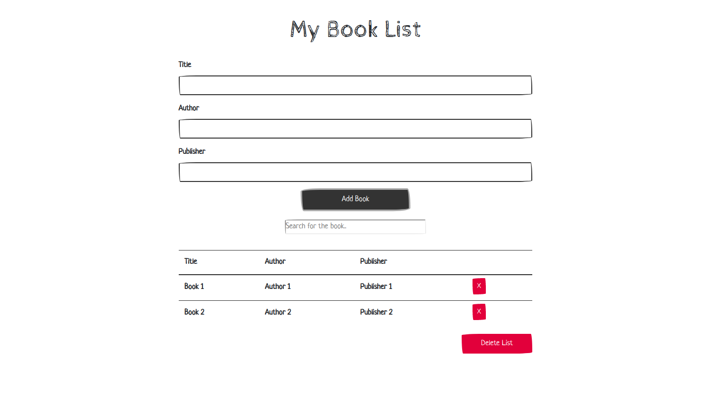

A simple book list in JavaScript,HTML/CSS and Bootstrap.

Based on Brad Traversy's book list but with a few changes (by me).

Changes:

- visual;
- add some extra logic stuff {
    - delete by title,
    - responsive desktop, 
    - required fields,
    - delete all books from list
}

- to do {
    - filter by title, author and publisher (on list)
    - owned, to buy tag
    - ,etc
}

